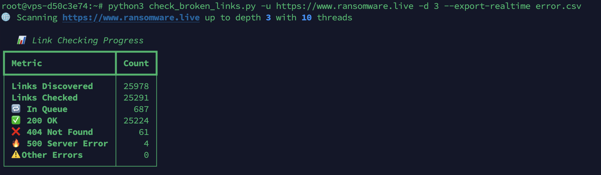

# 🔗 Internal Link Checker

**Multi-threaded Python tool to crawl and check all internal links on your website – with live progress, broken link export, and detailed reporting.**

[](https://fr.linkedin.com/in/julienmousqueton)
[](LICENSE)

---

## ✨ Features

- **Crawl and check** all internal links from any starting URL (configurable depth).
- **Multi-threaded** for fast site coverage.
- **Live terminal dashboard** using [Rich](https://github.com/Textualize/rich).
- Detects and reports **broken links** (`400`, `404`, `500`, and network errors).
- **CSV export** of broken links – at end of scan or in real time.
- Tracks and displays source pages for every broken link.
- **Easy to use:** works out-of-the-box, just give it a URL!

---

## 📸 Screenshot



> _Live progress: discovered links, checked, in queue, and error breakdown._


## 🚀 Quick Start

### 1. Install requirements

```bash
pip install requests beautifulsoup4 rich
```

### 2. Run the checker

Basic usage:
```bash
python check_broken_links.py -u https://example.com
```

#### Common options:

- **Set crawl depth:**  
  `-d 3` (default is 5)

- **Set number of threads:**  
  `-t 15` (default is 10)

- **Export broken links (after scan):**  
  `-e broken_links.csv`

- **Export broken links in real time:**  
  `--export-realtime live_broken_links.csv`

#### Example:

```bash
python check_broken_links.py -u https://example.com -d 3 -t 20 -e errors.csv
```

---

## 📄 Output

- **Terminal Dashboard:** Live stats and metrics.
- **Broken Link Summary Table:** After scan, a summary of all detected broken links with their source.
- **CSV Export:** If enabled, CSV file(s) containing:
    - Error code / message
    - Broken URL
    - Source page (where the link was found)

---

## 📝 Example CSV

| Error | URL                      | Source                |
|-------|--------------------------|-----------------------|
| 404   | https://example.com/foo  | https://example.com/  |
| 500   | https://example.com/api  | https://example.com/  |
| ERROR | https://example.com/bar  | https://example.com/  |

---

## ⚙️ Usage Details

- **Crawls only internal links** (same domain as your base URL).
- Handles HTML anchor tags (`<a href="...">`), skips `mailto:` and `tel:`.
- Follows links up to user-specified depth.
- Thread-safe, designed for performance.

---

## 👨‍💻 Author

Julien Mousqueton  
[LinkedIn: julienmousqueton](https://fr.linkedin.com/in/julienmousqueton)  
[@JMousqueton](https://twitter.com/jmousqueton)

---

## 📃 License

MIT License

---

## ⭐️ Feedback & Contributions

- Issues and PRs are welcome!
- Feel free to connect or [buy me a coffee](https://www.buymeacoffee.com/ransomwarelive) if you find this useful.

---

_Professional Python link-checking made simple and beautiful. Enjoy!_
